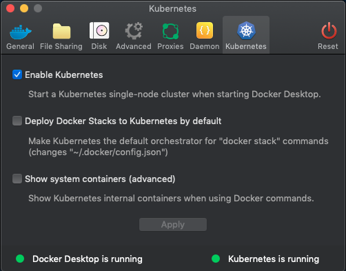
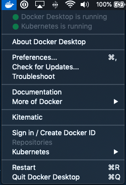
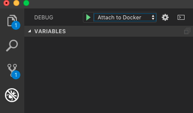

# ADI 2.0

## Getting Started

### Technologies

- [React](https://reactjs.org) is used for the front end client.
- [GraphQL](https://graphql.org) is being used in lieu of REST to provide a rich API that the browser client and other potential 3rd party services can use to interact with ADI.
- [Apollo](https://www.apollographql.com) provides the actual implememtation of GraphQL on the client and server side.
- [Neo4J](https://neo4j.com) is used to store metadata about ADI datasets in a graph structure.
- [ExpressJS](https://expressjs.com) is the classic web server, often forwarding requests to the Apollo GraphQL API, but it can also handle typical web requests.
- [Material UI](https://material-ui.com) is a UI framework of ready made React components for common UI elements.
- [Webpack](https://webpack.js.org) and [Babel](https://babeljs.io) are used mainly behind the scenes to compile and bundle client side code in a way that is compatible with most modern browsers.

### Prerequisites

* Docker and Docker Compose
* OpenStack credentials for object storage
* Node.js for your local development environment
* Ensure your docker environment has 4 gigabytes or more of memory for running ADI

### Setup

#### Kubernetes

##### macOS

On macOS, we recommend using the standard [Docker Desktop for Mac](https://download.docker.com/mac/stable/Docker.dmg) application. You will need to explicitly enable Kubernetes in **Preferences...**.



It may take a while to restart with kubernetes, so it's a good time for a coffee break. Once enabled, your status bar dropdown should look like this.



Once this is setup, you should find a new directory with a config file in your account: **~/.kube/config**. You'll want to copy this into your local ADI project config directory as 'kubeconfig':

```bash
# Assuming you're in the root project directory
cp ~/.kube/config ./config/kubeconfig
```

#### Application configuration

To create the initial configuration, copy the example config:

```bash
cp config/development.toml.example config/development.toml
```

Make sure to read the comments in this file. In many cases, you can just use the defaults
for development, but depending on your operating system and certain settings that don't have
a reasonable default, you'll have to follow the instructions given there.

Use your OpenStack credentials to populate the values in `[storage.object.creds]`. Note that,
for tempurls to work properly, you'll need to set `tenantId` *in addition to* `tenantName`, even
though, for basic swift usage, one or the other is usually sufficient.

#### OpenStack project

Source your OpenStack credentials and create the Swift containers:

```bash
swift post adi_datasets
swift post adi_scripts
```

If multiple people are using the same project and running their own ADI instances, you'll
need to come up with unique names for your set of the above containers. Whatever containers
you create here need to be referenced under the appropriate settings (for datasets and for
scripts) in your *development.toml* file.

For tempurls to work, you'll also need to set a secret key. This can be pretty much anything
you want. It's used to actually sign the tempurl access tokens, so you'll want to make sure
it's long and random enough that it can't easily be guessed.

```bash
swift post -m "Temp-URL-Key:your_secret_key_here"
```

#### Building application Docker images

Now build the Docker images and launch the application:

```bash
docker-compose build
docker-compose up -d
```

#### Migrations

After that's done, run the database migrations:

```bash
bin/migrate
```

#### Creating users

Finally, create the first user:

```bash
bin/create-user <user>
```

Now you should be able to login and start using the application from http://localhost:8080.

### Development

Node.js dependencies need to be installed locally (and you will need to install
[Node 12](https://nodejs.org/en/) on your machine) for autocompletion and linting:

```bash
cd server && npm install
cd client && npm install
```

If for some reason you don't want to install Node on your system, you should be able to get
away with the fact that the docker images do their own install by default. However, in this
case you would need to rebuild the affected images every time new packages are installed.

All source code is bind mounted into its respective container so any local changes will automatically be reflected in the running application without the need to restart containers or rebuild images.

### Scripts

There are a number of useful helper scripts in the `bin` directory:

* `add-user-to-org <user> <org>` - Adds an existing user to an existing organization
* `create-org <org>` - Creates an organization
* `create-user <user>` - Creates a user
* `migrate` - Run the database migrations
* `shell <service>` - Drops you to a bash shell in the specified service container

### Endpoints

* http://localhost:8080 - Client
* http://localhost:3000 - Server
* http://localhost:8080/graphql - GraphQL playground
* http://localhost:7474 - Neo4j Browser

### Neo4J plugins

ADI uses the following community libraries:

- [APOC](https://github.com/neo4j-contrib/neo4j-apoc-procedures): a bunch of useful procedures. We use the advanced search functionality APOC exposes.
- [GraphAware Framework](https://github.com/graphaware/neo4j-framework/): Framework required for GraphAware UUID
- [GraphAware Neo4J UUID](https://github.com/graphaware/neo4j-uuid): Automatically adds `uuid` properties to all nodes (see why we're using uuids and not the system ID value [here](https://neo4j.com/blog/dark-side-neo4j-worst-practices/)).

Current downloads for the GraphAware plugins can be found at: https://graphaware.com/products/

Current downloads for APOC can be found at: https://github.com/neo4j-contrib/neo4j-apoc-procedures#manual-installation-download-latest-release

The most current APOC download link is: https://github.com/neo4j-contrib/neo4j-apoc-procedures/releases/3.4.0.3

They may need to be upgraded at some point. There doesn't seem to be any sort of dependency/package manager for these and the files are relatively small, so the plugins are being checked into the repository (under neo4j/plugins).

### Debugging with VS Code

To debug the NodeJS server within VS Code, you need to first restart the server in debug mode:

```bash
bin/server debug
```

The server will not fully complete starting until you attach the debugger. You can do that by selecting the Debug panel in VS Code and then clicking the play button on the "Attach to Docker" configuration at the top.



After a few seconds, the startup should complete, and you will now be able to set breakpoints on the server code.

You may need to manually restart the debug server at times. You can do that by running the above command again. To go back to a regular development setup that doesn't require VS Code's debugger to be running, you can use:

```bash
bin/server development
```

### Migrations

Some changes will require data updates. There is a simple migration system in place. You can add a new migration (in python) by placing a file in services/migrations. You can run migrations via `bin/migrate`.

Migrations will be run in the order the names would be sorted, so you know for sure a migration shouldn't be run until another one has been run, you can affect the order by appropriate naming. The current convention is to prefix the migration name with a double digit integer to indicate order (`00_`, `01_`, etc).

One important assumption you should consider when making migrations is that all migrations are idempotent. That is, if they will do their own checking to see whether they need to change anything, based on the current state, and if there's nothing to change, they'll have no effect. Your migration script should be able to be run any number of times and only change data when it's not in the state it should be. This means you can also add to existing migrations if it makes sense, but it also means that there isn't really a concept of rolling back.

### Integration Tests

With a little setup, you can run integration tests in a completely separate environment. The only truly manual thing you need to do at the moment is setup swift containers specifically for testing:

```bash
source YOUR_SWIFT_CREDENTIALS.sh
swift post adi-YOURNAME-testing-datasets
swift post adi-YOURNAME-testing-scripts
```

Now create a copy of your _development.toml_ file called _testing.toml_:

```bash
cp config/development.toml config/testing.toml
```

Finally, edit the object storage section to point to the containers you just created:

```toml
[storage.object.containers]

datasets = "adi-YOURNAME-testing-datasets"
scripts = "adi-YOURNAME-testing-scripts"
```

The test environment does take a bit of time to set up and tear down, so you may want to leave it running between test runs (though then you'll have to make sure to clean up after a test run).

To start up the test environment:

```bash
bin/testenv start
```

This will create a new user called *test*, with a password of *password* and an apikey of *test-token*. Obviously, this is about the furthest from secure passwords and tokens you can imagine, so you don't want to expose the testing environment to the outside world, and by default you shouldn't even be able to access it from the host machine.

To actually run tests:

```bash
bin/testenv_run
```

Currently this just runs _test/integration/main.py_ within a simple python container that has access to the testing environment.

If you need to check out something inside the test environment, you can still look inside of it by going to the _./test_ directory and running `docker-compose` commands from there. Doing a `docker-compose ps`, for example will show you all the instances running in the test environment.

To shut down the test environment, run:

```bash
bin/testenv stop
```

This will also get rid of the volumes Docker creates for the test instances, so you'll be starting from a completely clean slate the next time around (one exception: anything still residing in your swift storage containers isn't deleted at the moment).

### Debugging Jenkins failures

When the integration tests fail on a Jenkins run, why they failed can be rather mysterious because it's not easy to see
any actual errors that may have been triggered on the server, only the ones that flow through to the test.

There's already a change in place that stores any Docker output from the server, database, etc. after executing the
tests, so it may be helpful in diagnosing problems that don't seem to appear in a devleopment environment.

Here's how you navigate to the logs that are now being written:

1. Click the Jenkins classic icon if you're not already there
2. Go to the workspace (it should have the entire code branch that was part of this Jenkins build)
3. Check test/log/integration-test.log

### Jenkins 

To get the Jenkins pipeline working the following credentials need to be set in Jenkins:

* **staging-docker-uri**: The Docker server uri for the project. It's usually: `tcp://<your-server-url>:2356`.
* **adidockerhub**: DockerHub login credentials. 
* **adi-staging**: Docker host key for ADI environment.
* **server-image**: Name of the ADI server docker image.
* **neo4j-image**: Name of the ADI neo4j docker image. 
* **adi-slack-channel**: Slack channel name to send Jenkins pipeline run failure messages to.
