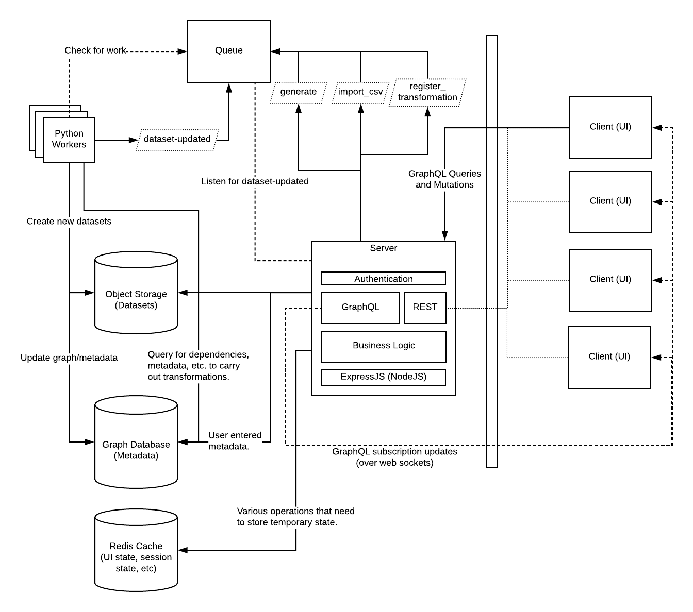
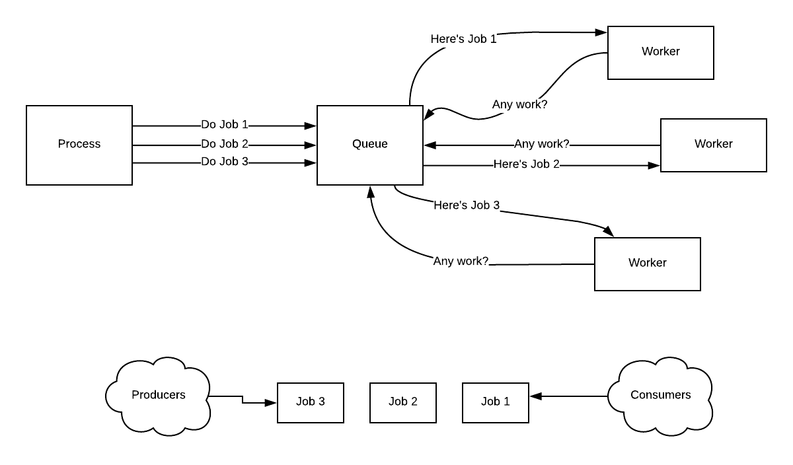
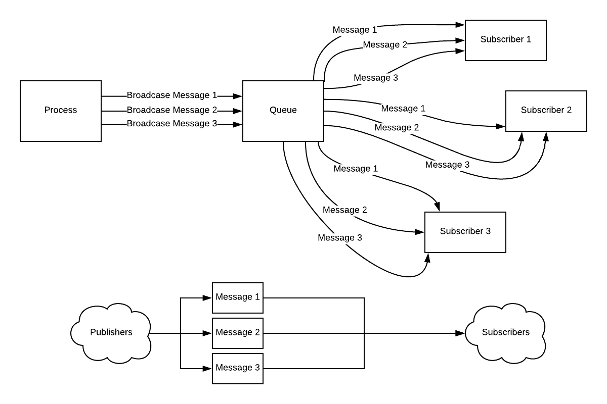

# Architecture

## Introduction

> This is the Unix philosophy: Write programs that do one thing and do it well. Write programs to work together. Write programs to handle text streams, because that is a universal interface.

*- Doug McIlroy (2003)*

Though the above quote is talking about building an operating system, the architectural philosophy it describes is central to the current version of ADI. Whenever possible, we build or use relatively independent components with a minimal set of responsibilities that work together to get more complex tasks done. In a way, we're even taking on the last principle, though in our case, the "universal interface" is flat, 2D tables, stored in an easy to parse format (right now CSV, in the future, perhaps something like Parquet), that undergo a series of transformations.

Here's a diagram of how these components interact.



The components are explained in more detail below, but here's a summary and some working definitions:

- Server: The main process that handles web requests from individual clients. It is responsible for authentication, authorization, and an API that clients can query and command. The server uses GraphQL in most cases, over REST, to provide a flexible API.

- Queue: This is the hub for passing messages between various components on the server side. It can distribute work and also broadcast the results of that work.

- Workers: These are the processes that carry out individual transformations. Right now, we only support Python, but a different worker for a different language could be set up to handle those tasks.

- Client (React): This is the front end user interface of ADI. It is originally served from the Server, but afterwards lives almost completely within a user's browser. When it makes further requests from the Server, it only really needs data (and for the server to determine that it is authorized to have that data).

- Storage: Where possible, we're streaming uploaded files and transformations directly to and from object storage. Object storage (like Swift in OpenStack or S3 in AWS) allows for infinitely expandable containers (ultimately expanded by the object storage provider adding more hard drives) and redundant, fault tolerant storage.

- Graph database: Metadata about the datasets is stored in a graph database, where we can model the connections between the datasets, columns, etc.

## Transformation Engine

### What is a Transformation?

Transformations are intentionally simple. Whenever a dataset is produced by manipulating a dataset and/or combining multiple datasets, they undergo a "transformation". Furthermore, that "transformation" can always be described by code.

When talking about Transformations in the Transformation Engine of ADI, it's important to be strict about this. You could, for example, say that manually adding rows to a dataset is "transforming" it. And, if you really wanted to, you could take a dataset that is computed from a bunch of other datasets and manually add rows to it. If you encountered a situation like this, to reframe it in pure transformations, you would have 2 options:

1. Add the new rows to the source dataset and re-run the Transformations.
2. Create another dataset with the new rows in the same format as the final Transformation you want to add to and create *another* Transformation that appends those rows. This may be a method you use if you do not have access to the original source dataset or it contains a lot of unnecessary information.

Describing everything that happens to a source dataset (or several source datasets) to get you to a desired final datasets in terms of these Transformations means that by keeping track of each individual Transformation (along with its inputs and outputs), you can reproduce the data at any point simply by tracing back to the source dataset (or, in the case where the first dataset is itself created from a Transformation, the first Transformation with no input) and rerunning every Transformation until the dataset you are interested in.

In other words, when we think about Transformations in this strict sense, it makes it easy to describe our data in terms of getting from point A to point B on a graph of nodes. The complexity is not in the individual Transformation. Rather, it emerges from their connections to each other.

### The Transformation Engine

The "Transformation Engine" isn't really a single thing. It's the combination of keeping track of Transformations (as described above) in a graph database and providing various services that can navigate that graph.

Here's how this is used to generate a dataset when a dataset it depends on is updated:

1. Follow the graph backwards until there are either no inputs to a Transformation or every input is a raw dataset.
2. Order the Transformation nodes from the furthest from the dataset you want to regenerate to the closest.
3. Run each transformation, from the furthest to the closest.
4. When the last Transformation is run, the dataset is up to date.

### But I can do the same thing in a big script...

Understanding that code is just one instruction after another, it's a fair question to ask: why not just write one long script? That script can also be rerun to generate a final dataset from an initial one.

The key thing to remember here is that if someone else (or you, a few months later) decides that one of the transformations in the middle of that long script is useful for something else, the code will at least need to be modified to output that intermediate dataset. That will require understanding the code well enough to modify it. But furthermore, it requires understanding the code well enough to even know that this intermediate transformation is there.

By making it easy to chain Transformations as if they were just one block of code and encouraging thinking of data problems in terms of a bunch of little Transformations, we end up communicating these possible intermediate datasets as a side effect. No one needs to understand the code that comes before or after a particular intermediate dataset. They just need to know that that's the dataset that interests them.

Thus, in working on specific problems within ADI, we also effectively map out the territory of the data the we're using in a way that it can be used on *other* problems in the same way we might pick a point on a map to start out from and another point as our destination.

### Enhancing the Graph

Note: These are not necessarily implemented yet, but they represent ways that more power can be added to the Transformation Engine:

1. Adding a "last updated" date to datasets would allow us to skip Transformations that we know wouldn't change anything. How do we know they wouldn't change anything? If our input node has a "last updated" date earlier than the output node, then it hasn't changed since the Transformation last ran. Since we've been strict with our definition of Transformations, we know this would produce the same thing. (One valid exception may be a transformation that intentionally produces some sort of randomness, in which case, we could mark it to always run).

2. Datasets aren't the only thing we can draw connections between on the graph. We can also connect columns of datasets based on shared properties. For example, we might identify certain columns as containing temperature values. Furthermore, we may distinguish between Celsius and Fahrenheit. Tagging these columns as such in a graph gives us paths to understand data that *might* be connected. In other words, we can use the graph to suggest new Transformations. Furthermore, in certain cases, it may allow us to provide automatic Transformations without the need for specific code. Once we know how to convert Fahrenheit to Celsius once, there's no need to do it again. And knowing that this conversion is possible allows us to recognize that it's possible to join data between the two. This knowledge is effectively encoded in the graph.

3. Versions: In many cases, users of ADI will *want* to always get the most up to date version when regenerating datasets. However, in some cases this may be undesireable. Versioning would add some complexity, but it's made a little easier by recognizing that a version is just another node on the graph. We would simply need to provide an appropriate way to address those versions in our Transformations. This problem has been solved many times over in dependency management for software development. In terms of ADI, "someuser:iris:1.0" could identify "version 1.0" of the "iris" dataset owned by "someuser". "someuser:iris:latest" could identify the last version, whatever that may be. In this way, versioning really becomes a problem of conventions (how do we address our data?) and record keeping.

## The Queue

Crunching data can take some time. When we click a button on the ADI front end that might result in some heavy data crunching, we don't want to be worried about closing our browser window or having connection problems. We want that to continue in the background and let us know when it's done. Furthermore, if there's a *lot* of work to be done, we want ADI to be flexible enough to handle it. Finally, it would be great for others we're working with to find out about updates without having to tell them directly.

This sort of interaction is increasingly common in applications, and message queues make it all possible. We're using RabbitMQ specifically.

What's the difference between running things without a queue and using one? Well, without a queue, you basically kick off a task and then have to keep track of it all the way through. "Are you done yet? Are you done yet? Are you done yet?" If you have multiple options for where to send the work, you have to know about them. And you have to ask each one if it can take your task.

A queue, on the other hand, acts kind of like a community bulletin board. Instead of looking for a service to take a task directly, you just put a message up saying that this task needs to be done. And some service comes along and has capacity to do the job. It finishes it and then puts another message up saying it's done.

Of course, a software queue has several advantages over our bulletin board. One is that it's pretty instantaneous for all parties. The other is that it can operate in a variety of ways. We use two in particular:

1. Producer/consumer work queues: The producer posts a single message. The *first* consumer that can handle the message takes it off of the queue. This avoids multiple workers doing the same task and provides an easy way to scale the work. This is how we farm out transformation tasks.

  

2. Publish/Subscribe broadcasting queues: The publisher posts a single message and every subscriber that's interested gets it. Think of this like a TV station broadcasting a show to an audience. This is how anyone with the correct permissions can get informed of new datasets or when datasets they've sent to generate have finished.

  

This architecture allows us to create specific microservices that do one job really well and can scale by simply creating more of them. It also gives them an easy way to communicate back to the main server and ultimately individual users.

## GraphQL

GraphQL is an alternative to REST. Imagine you have a blogging platform. One URL path might give posts:

|                 |                   |
|-----------------|-------------------|
|/posts/          |a list of posts    |
|/posts/1234      |a single post      |

Another might give comments on a post:

|                       |                   |
|-----------------------|-------------------|
|/posts/1234/comments   |a list comments    |
|/comments/1234         |a single comment   |

But you may also want to see all comments a particular user has made. Or all comments made on a particular topic, etc. It's really hard to model everything you'd ever want to do with your data via REST. Furthermore, without extending those simple REST endpoints with things like URL parameters, you almost always get either more data than you want or too little data from a single endpoint.

Instead of multiple endpoints, GraphQL is a specification for sending structured requests to a single endpoint, specifying the data you actually want. So, for example, to retrieve a blog post, you might send:

```graphql
query {
  post {
    author
    content
  }
}
```

To get the post along with the first 5 comments:

```graphql
query {
  post {
    author
    content
    comments(start:0, count:5) {
      author
      content
    }
  }
}
```

GraphQL itself is just a specification. We're using Apollo GraphQL to implement both the server side endpoint and the client side requests.

Apollo GraphQL also allows us to use GraphQL's "Subscriptions" which can receive updates from a server via websockets so that a client can immediately be informed of a change on the server. This is an attractive alternative to methods that require continuously polling a server for status updates. That said, Apollo GraphQL does also allow options to do polling queries as well as immediate query refreshes. Combined with the RabbitMQ messages and React, it can provide a seamless multi-user desktop application experience in a web browser. This is the sort of experience that could help data science teams work more effectively on data problems.

## React

On the client side, we're using ReactJS. It's one of several modern web frameworks that is largely geared towards "single page applications" that feel more like a desktop app than a typical web page.

In a departure from earlier Javascript frameworks, the key to React is that, instead of directly manipulating elements in the DOM, you tell components how they should render given particular data, and when there's a change in data, React figures out how much of everything it actually has to redraw.

In some ways, the way React works mirrors the Transformation Engine: both focus on declaring what should happen in a structured way and in return for that, they handle the nitty gritty details of actually going from one state to another.

Sometimes "client" can be ambiguous. With React, it means that the entire interface of the application effectively lives in the user's web browser. There are ways to do server side rendering for various purposes, but most of the heavy lifting for the interface is truly done client-side. This turns the classic web server into a way of accessing data and enforcing security.

## Workers

Workers are the processes that listen to messages advertising new tasks on the queue and ultimately process them. There can be multiple workers that do the same thing. There can also be specialized workers that only do certain tasks.

Right now, we just have a "python-worker". But there could be an "R worker" that runs Transformations coded in R, or a "Google BigQuery worker" that ships data to Google's BigQuery and crunches it there. The more services like this that we add, the more we'll figure out how to make it easier to add the next.