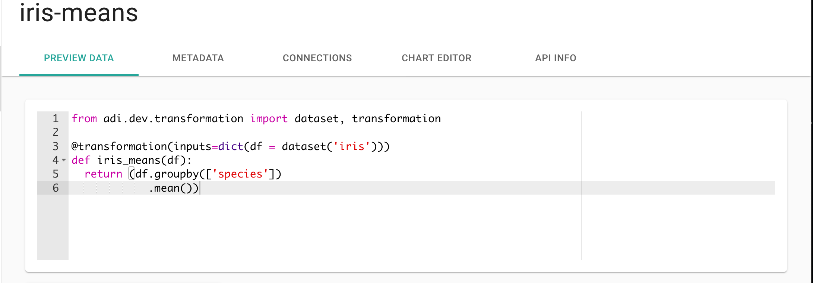

## What are computed datasets?

A computed dataset is like a regular dataset in almost every way, except instead of uploading data to them, you supply a code block that outputs a dataset.

We refer to these code blocks as transformations. Transformations can take any number of datasets you have access to as inputs (even other computed datasets) or none at all (your code block could access an API hosted elsewhere to fetch initial data). The output will be the dataset you create the transformation on.

## Python transformations

ADI currently supports making a computed dataset by supplying a Python code block. Other languages may be supported in the future. Here's what a transformation looks like on the platform:



## The simplest transformation you could write

A transformation needs to produce a dataset as the return value of a `transform()` function. The simplest transformation you could write does nothing, simply making a duplicate of the dataset you have:

```python
dataset = dataset_input('Your Dataset Name')

def transform():
  return dataset
```

While that's not very interesting, it's a good way to start, even with more complex transformations. But first, let's look at how this very basic transformation works.

Let's start at the first line:

```python
dataset = dataset_input('Your Dataset Name')
```

This line sets the `dataset` variable to a [Pandas Dataframe](https://pandas.pydata.org/pandas-docs/stable/dsintro.html) representing the dataset in ADI with the name `'Your Dataset Name'`. It handles figuring out where the original dataset is stored and properly loading it.

The return value of `transform` is expected to also be a [Pandas Dataframe](https://pandas.pydata.org/pandas-docs/stable/dsintro.html). The transformation engine will handle storing this dataset properly for you.


It's important to make your `dataset_input` assignments outside of the `transform` function. When saving the transformation, the `dataset_input` calls are used to correctly establish relationships between datasets, which in turn is used to figure out dependencies when running transformations that depend on other transformations.


### Name addressing

Under each organization, dataset names are required to be unique. If you have access to more than one organization, you can reference a dataset from the other organization in your transformations. Simply put the organization name first, followed by a colon (`:`) when referencing the dataset. For example:

```python
dataset = dataset_input('Organization 1:Your Dataset Name')
```

references the dataset with `'Your Dataset Name'` under `'Organization 1'`.

You can only create transformations using datasets you have access to through the organizations you belong to. However, anyone belonging to an organization that you create your transformation in can use that transformation.

For example, consider User A and User B, where User A belongs to Organization 1 and 2 and User B belongs to Organization 1 and 3. Understanding that both belong to Organization 1, it means both will be able to use any dataset, computed or raw, in Organization 1. However, only User A will be able to create a computed dataset that uses another dataset from Organization 2 as an input (User B has no direct access to datasets under Organization 2). Once created, User B will be able to use the computed dataset under Organization 1, even though it accesses a dataset under Organization 2.


Cases involving computed datasets that use input datasets spanning organizations can get quite complex, and given that this is pre-alpha software, access control in this area is very rudimentary. The most secure mode of operation with multiple organizations is to only operate within the single organization. The next most secure mode is to only have members using datasets where any input datasets belong to organizations that all the users belong to. Any serious use of the software under a multi-organizational scheme should be well tested before use in production, even when only operating within organizations.


### Pandas

Before they're given to the `transform` function, the raw datasets are read into [Pandas](https://pandas.pydata.org) dataframes. Pandas is a Python library that provides functionality to manipulate data structures in a fast and efficient manner.

Please refer to the [pandas documentation](http://pandas.pydata.org/pandas-docs/stable/) if you need help understanding how to do particular data manipulations. However, here are a few common manipulations you're likely to want to do:

1. Group by a column:

  The following code will return a transformation on `inputdf`, where it is grouped by 'column_a'. If you wanted to group by two columns (say, 'year' and 'month'), you'd just add the other column to the array you pass in.

  ```python
  groupdf = inputdf.groupby(['column_a'])
  ```

  Usually you'll want to do something with your grouped data before returning it. Often this is running an aggregating function on numerical columns in the data, or doing a simple count.

  The following computes the mean of any numerical column among members of each group:

  ```python
  groupdf.mean().reset_index()
  ```

  The following counts the size of each group (in terms of number of rows):

  ```python
  groupdf.size().reset_index(name='count')
  ```

  Note that you often will want to call `reset_index` after these aggregating functions, as otherwise the group values themselves with become the index. In the case of `count`, since it produces a brand new column, you also supply the name of the new column to the `reset_index` call.

2. Join two datasets by one or more columns:

  ```python
  import pandas as pd
  pd.merge(inputdf1, inputdf2, on="column_a")
  ```

  Multiple columns:

  ```python
  import pandas as pd
  pd.merge(inputdf1, inputdf2, on=["column_a", "column_b"])
  ```

3. Filter by a value in one or more columns:

  Greater than:

  ```python
  inputdf[inputdf['column_a'] > 4]
  ```

  Equal to:

  ```python
  inputdf[inputdf['column_a'] == 4]
  ```

  One of a list of values:

  ```python
  inputdf[inputdf['column_a'].isin([4, 6])]
  ```

4. Drop a column:

  ```python
  inputdf.drop(columns=['column_a'])
  ```