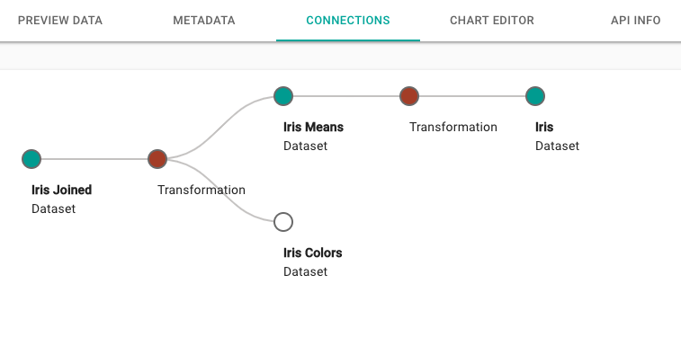

# Connections

Metadata about the datasets, along with inputs and outputs of transformations, is stored in a graph database. This makes it easy to do things like trace the lineage of a dataset. For example, here's a dataset that is the product of two uploaded datasets, one of which goes through an intermediate transformation before being joined:

This connection visualization will be automatically generated for every dataset you create. In most cases, it will look fairly simple (regular uploaded datasets will only show a single node), but in cases where a dataset is the result of multiple transformations, it can be a useful way to understand how it was derived.