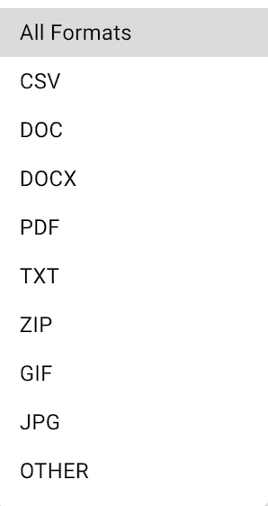
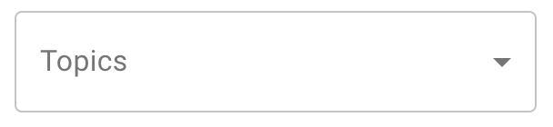
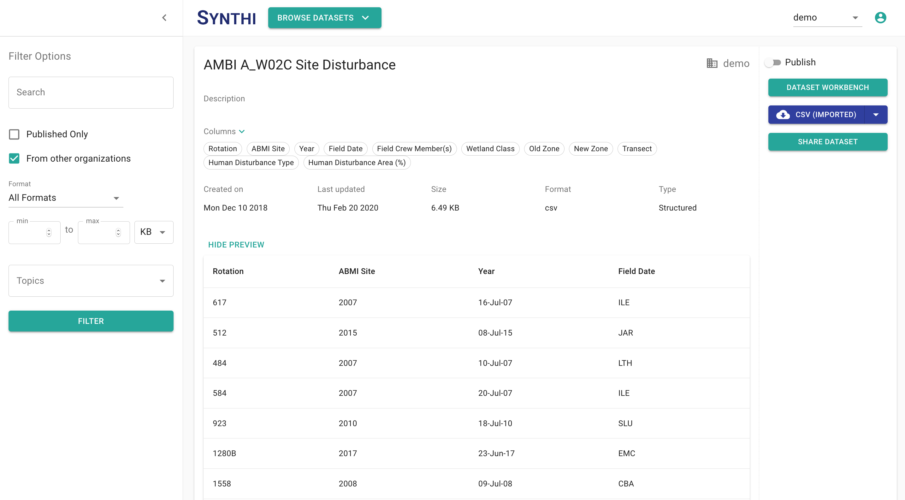

## Browsing Datasets

### Finding a Dataset

The Filter Options sidebar on the Browse Datasets page allows a user to find a dataset through multiple methods. 


For more information about the search bar, visit the **[Search](/sections/Search.md)** section.


Right under the search bar, there are multiple filter options that allow users to find the dataset they are looking for. Lets start with the checkboxes [Published Only] and [From other organizations]/

1) Unselecting both 'Published Only' and 'From other organizations' checkboxes and selecting the filter button returns both published and unpublished datasets from your organization.
2) Selecting both 'Published Only' and 'From other organizations' checkboxes and selecting the filter button returns only published datasets from your organzaition and all shared datasets from other organizations.
3) Selecting only 'Published Only' checkbox and selecting the filter button returns only published datasets from your organziation.
4) Selecting only 'From other organziations' checkbox and selecting the filter button returns all the datasets - published and unpublished form your orgazation and all shared datasets from other organizations. This is the default state of the filter options side bar.

Under the checkboxes is the 'Format' dropdown that allows a user to select a file format and filter datasets based on the format of the file. 

Clicking on the 'Format' dropdown opens up a list of file types that a user can select from.

Under the Format dropdown is the option for a user to select a file size to filter the datasets down the size of their choice. 

The user is able to manually enter the minimum and maximum file size they are looking for while selecting the unit of measurement in KB/MB/GB from the dropdown below the min/max boxes. 

Finally, the user can also filter down the datasets using a list of pre-populated Topics. 

Selecting the topic dropdown opens a list of topics that a user can select. A user has the option of selecting more than one topic for the filtering purpose.


Click on the Filter button at the bottom of the Filter Options sidebar to ensure filter selections show up on the dataset browser.



The filters work together. A user can deploy multiple filter options at the same time and the result will be a combination of all the filters that have been applied.


Upon making the filter selections, a user will find their choices being reflected on the Browse Datasets page. From here, a user has the option of scrolling through multiple datasets, previewing them, opening them on the Dataset Workbench, publishing them (if the dataset belongs to their organization), as well as downloading them.

### Reviewing a Dataset

Clicking on the SHOW PREVIEW button at the bottom of each dataset opens up a preview window that provides a glimpse of the dataset you have selected. Clicking on HIDE PREVIEW collapses this preview window. 

Apart from this, a user can also look at the list of columns that is shown on each dataset. Clicking on the Columns dropdown opens up a table that shows the variable type (integer/string/boolean etc.) of the column.

### Managing a Dataset

The Browse Dataset page allows a user to publish their datasets, move a dataset to the Dataset Workbench and download the dataset in the imported or original format.


For more inforamtion on the Dataset Workbench, visit the [Workbench](/sections/DatasetWorkbench.md) section.



Selecting the 'Publish' option allows a user to share a dataset with anyone who has access to the Synthi platform.

