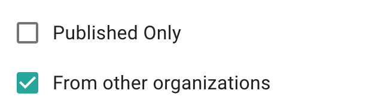
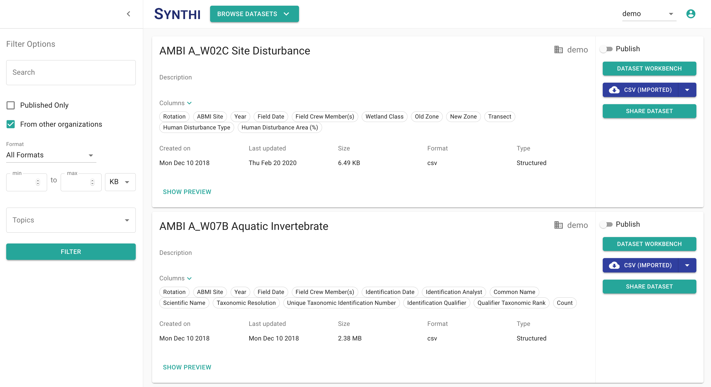

## Browsing Datasets

### Finding a Dataset

The *Filter Options* sidebar on the Browse Datasets page allows a user to find a dataset through multiple methods. 


For more information about the search bar, visit the **[Search](/sections/Search.md)** section.


Under the search bar, there are multiple filter options that allow users to find the dataset they are looking for. You may want to start with the checkboxes [Published Only] and [From other organizations]:

1) To return both published and unpublished datasets from your organization, unselect the 'Published Only' and 'From other organizations' checkboxes, and then select the filter button.
2)To return only published datasets from your organization and all shared datasets from other organizations, select  the 'Published Only' and 'From other organizations' checkboxes, and then select the filter button.
3) To return only published datasets from your organization, select the 'Published Only' checkbox and then select the filter button. 
4) To return all the datasets - published and unpublished - from your organization, and all shared datasets from other organizations, select the 'From other organizations' checkbox, and then select the filter button. This is the default state of the filter options sidebar.

Under the checkboxes is the 'Format' dropdown, which allows a user to select a file format, and filter datasets based on the format of the file.

Clicking on the 'Format' dropdown arrow displays a list of file types that a user can select from.

In the format dropdown is the option to select a file size.

The user is able to manually enter the minimum and maximum file size they are looking for, while selecting the unit of measurement in KB/MB/GB, from the dropdown below the min/max boxes.

Finally, the user can also filter down the datasets using a list of pre-populated *Topics*. 

Selecting the topic dropdown opens a list of topics to select from. A user has the option of selecting more than one topic for the filtering purpose.


Click on the Filter button at the bottom of the Filter Options sidebar to ensure filter selections show up on the dataset browser.



The filters work together. A user can deploy multiple filter options at the same time and the result will be a combination of all the filters that have been applied.


Upon making the filter selections, the user will find their choices being reflected on the *Browse Datasets* page. From here, they have the option of scrolling through multiple datasets, previewing them, opening them on the Dataset Workbench, publishing them (if the dataset belongs to their organization), or downloading them.

### Reviewing a Dataset

Clicking on the *Show Preview* button at the bottom of each dataset opens a preview window that provides a glimpse of the dataset you have selected. Clicking on *Hide Preview* collapses this preview window. 

Apart from this, a user can also look at the list of columns that is shown on each dataset. Clicking on the *Columns* dropdown opens up a table that shows the variable types (integer/string/boolean etc.) of the column.

### Managing a Dataset

The *Browse Dataset* page allows a user to publish their datasets, move a dataset to the *Dataset Workbench*, or download the dataset in the imported or original format.


For more inforamtion on the Dataset Workbench, visit the [Workbench](/sections/DatasetWorkbench.md) section.



Selecting the 'Publish' option allows a user to share a dataset with anyone who has access to the Synthi platform.

