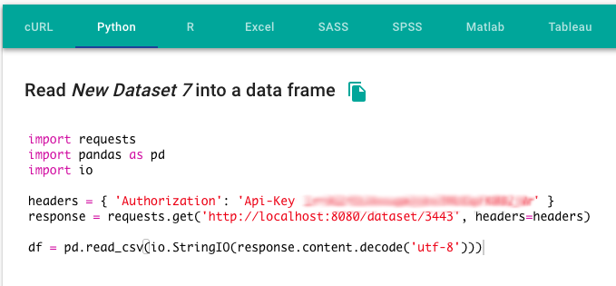
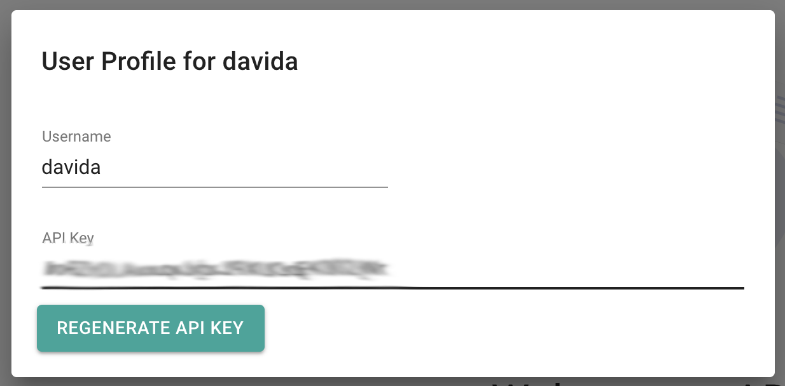

# Exporting

The Synthi platform allows you to export your data in a variety of ways. This enables you to work with the data using tools you're familiar with, while still using the collaborative aspects and transformation pipeline of the platform.

## User interface

The simplest way to export a dataset is to use the *Download* button that is included in the *Preview Data* tab of every dataset, whether it is uploaded or computed within the platform.


This will trigger a download of the dataset in a normalized .csv format: comma delimiters and a column name header. It will also re-run any transformations the current dataset might depend on, if it is a computed dataset.


Under current functionality, the column names exported will be whatever they were when they were imported. Or in the case where the original data did not have column names, they will be 'Column_1', 'Column_2', and so on. You can query changed column names by an API call, discussed below, and replace them externally, or you could create a transformation within the Synthi platform to change the column names in a new computed dataset to work around this limitation.

*Computed Datasets*: All transformations that a computed dataset depends on will be re-run when a download is triggered, even if the underlying data has not been changed. Functionality would need to be added to the transformation engine to skip transformations where their input datasets have not been changed since the last run.


## API Exports

You do not need to use the user interface to import and export data. However, you can find some of the other options through the interface. The *API Info* tab lists many of these in easy-to-use code snippets that you can copy and paste into other popular environments.


Here's what the Python API Info looks like:



If you click the  icon to the right of the title of any section, it will copy all of the code to your clipboard.

### API Keys

An important piece of any code snippet is the API Key. This key is tied to your user account and gives access to any of the information you would have if you were logged in. It is important to keep it safe and out of untrusted environments. However, if it is compromised for a particular user, you can regenerate the key for that user.

To regenerate an API key (or to generate one for the first time), go to your user profile under the  icon in the top right of the screen:




You may want to consider setting up individual user accounts for the sole purpose of API access in different external environments. Each user will be able to access any dataset under any of the organizations it belongs to, but if the API key is compromised in a particular environment, you could just regenerate the key for that user.


## cURL snippets

While we're not expecting you to use the Synthi platform from a terminal window, the *cURL* snippet section may be the most important section of the API to help integrate third party tools within the platform. cURL is a command line utility, installed by default on MacOS and 'nix systems, but also [available for Windows](https://curl.haxx.se/windows/). With it, you can make pretty much any kind of web request, and it's easy to script. More importantly, it is one of the most direct and well documented ways of making programmatic web requests. If you have trouble understanding any of the examples we've included, there is plenty of documentation available online to help you understand. And if you can make it work with cURL, you can easily translate the command into any programming language or tool that has a web request API.

Here are some of the common flags that we use:

`-H`: sends an HTTP header. Specifying an `Authorization` header is how we prove we should have access to a particular resource, and a `Content-Type` header allows us to specify what we're expecting back, especially useful when there are a number of potential options. When we're downloading a dataset, we expect just lines of a file. But when we're making other requests, we're often expecting the server to respond with structured JSON data.

`-X POST`: sends a `POST` request instead of the default `GET` request.

`-s`: tells cURL to only display information from the server, silencing any informational/error text from cURL itself

```bash
--data @- << EOS
...
...
EOS
```

allows us to send a multiline string in the body of our request. Many API requests are backed by a [GraphQL](https://graphql.org/learn/) service that receives structured requests, and returns data in the same structure. For example, this request which is run on a classic [iris](https://www.kaggle.com/uciml/iris) dataset:

```bash
curl -s http://localhost:8080/graphql \
-X POST \
-H "Content-Type: application/json" \
-H "Authorization: Api-Key your-api-key" \
--data @- << EOS
{
  "query": "{
    dataset(id: 2485) {
      id 
      columns {
        name
        order
      }
    }
  }"
}
EOS
```

will return the following JSON:

```json
{
  "data": {
    "dataset": [{
      "id": 2485,
      "columns": [{
        "name": "sepal_length",
        "order": 1
      }, {
        "name": "sepal_width",
        "order": 2
      }, {
        "name": "petal_length",
        "order": 3
      }, {
        "name": "petal_width",
        "order": 4
      }, {
        "name": "species",
        "order": 5
      }]
    }]
  }
}
```

Notice how the fields follow the same order and nesting that the original request used. This is a key characteristic of any GraphQL request.

## Importing Data with the API

You can also update your datasets from the API. Unlike the other API requests, this one requires at least one piece we can't predict, and that's the file you want to upload. Here's how you would format a cURL request to update a dataset of ID `123` with a file: `/path/on/your/computer/new-data.csv`.

```bash
QUERY=$(cat << 'EOS' | tr '\r\n' ' '
{
  "query": "
    mutation UploadDataset($id: Int!, $file: Upload!) {
      updateDataset(id: $id, file: $file) {
        id
        name
      }
    }
  ",
  "variables":{
    "id": 123,
    "file": null
  }
}
EOS
)

curl 'http://localhost:8080/graphql' \
-X POST \
-H "Authorization: Api-Key your-api-key" \
-F operations=$QUERY \
-F map='{ "0": ["variables.file"] }' \
-F 0=@/path/on/your/computer/new-data.csv
```

Importing is one area where a non-cURL implementation, via a true programming language, is probably much simpler. This is because most of the complexity here deals with creating multi-line strings in a shell environment like bash, and also passing those strings in the correct order to the cURL command.

There are two key pieces here:

1. The GraphQL query to tell the API what you want to do and where you want to do it (that's where you specify the dataset ID). 
2. Passing the file along in the way it's expected as part of a multi-part web request. 

This is about the most complicated style of web request you can make, where you want to send whole files along with some structured information. However, with a few changes, you could turn this into a script:

```bash
upload-dataset.sh your-api-key 123 /path/on/your/computer/new-data.csv
```

Here's what the upload-dataset.sh would look like (note that it's currently hard-coded to the development URL of the site):

```bash
#!/bin/bash

API_KEY=$1
DATASET_ID=$2
FILEPATH=$3

QUERY_PART_1=$(cat << 'EOS'
"query": "
  mutation UploadDataset($id: Int!, $file: Upload!) {
    updateDataset(id: $id, file: $file) {
      id
      name
    }
  }
"
EOS
)

QUERY_PART_2=$(cat << EOS
"variables":{
  "id": $DATASET_ID,
  "file": null
}
EOS
)

QUERY=$(echo "{ $QUERY_PART_1, $QUERY_PART_2 }" | tr '\r\n' ' ')

echo $QUERY

curl 'http://localhost:8080/graphql' \
-X POST \
-H "Authorization: Api-Key $API_KEY" \
-F operations="$QUERY" \
-F map='{ "0": ["variables.file"] }' \
-F 0=@$FILEPATH
```