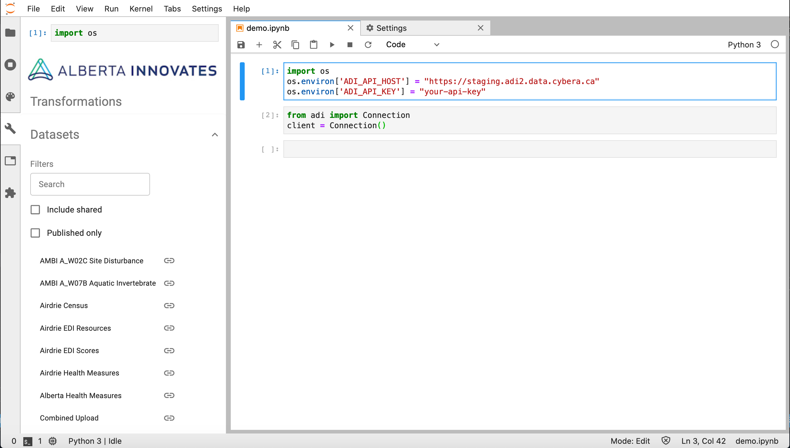
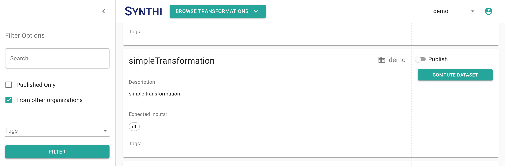

##  JupyterLab API

  A JupyterLab extension to interact with the ADI platform. 

  ### Installation
  
  The installation and setup instructions are available in the [jupyterlab-adi](https://github.com/cybera/jupyterlab-adi.git) GitHub repository. When everything is setup correctly, you should see a  icon on the sidebar when you open a notebook.

  

  ### Datasets

  The Datasets sidebar shows the list of datasets that are linked to your organization.

  

  * The link icon next to each dataset will take you to the dataset in the ADI platform. 
  * The "Filters" field, "Include Shared" and "Published Only" checkboxes allows you to search a dataset of interest by filtering based on various dataset metadata. See [Search](sections/Search.md) section for more details on how to use it.


  ### Connecting to ADI

  Install the [python-adi](sections/PythonADI.md) package, then import the environment variables by running this in a notebook cell.

  ```python
    import os
    os.environ['ADI_API_HOST'] = your_api_host
    os.environ['ADI_API_KEY'] = your_api_key
  ```

  

  Now you can use the python-adi package to connect to adi and work with the datasets and organizations that are accessible to you within ADI in addition to full capabilities of the JupyterLab. 


  ### Transformation

  
  This section is only a proof of concept. Creating and running transformation functions have changed since this feature was initially built so this needs to be modified to reflect those changes.
  
  

  You can write reusable transformation functions here in a notebook, save it, run it and import it into ADI to use them later with other datasets.

  The JupyterLab widget will recognize regular Python methods and turn them into transformations with a few simple rules:
  * any top level method is a possible transformation.
  * the method parameters get turned into dataset's input references.

  

  When you click on Create transformation button, the widget saves the code to ADI. You can add description and tags to your transformation code to make it easy to filter while searching for them in the Browse transformations page in ADI interface.

  To view the transformation that you just created open up ADI interface and go to the Browse transformations page.

  


  


  
