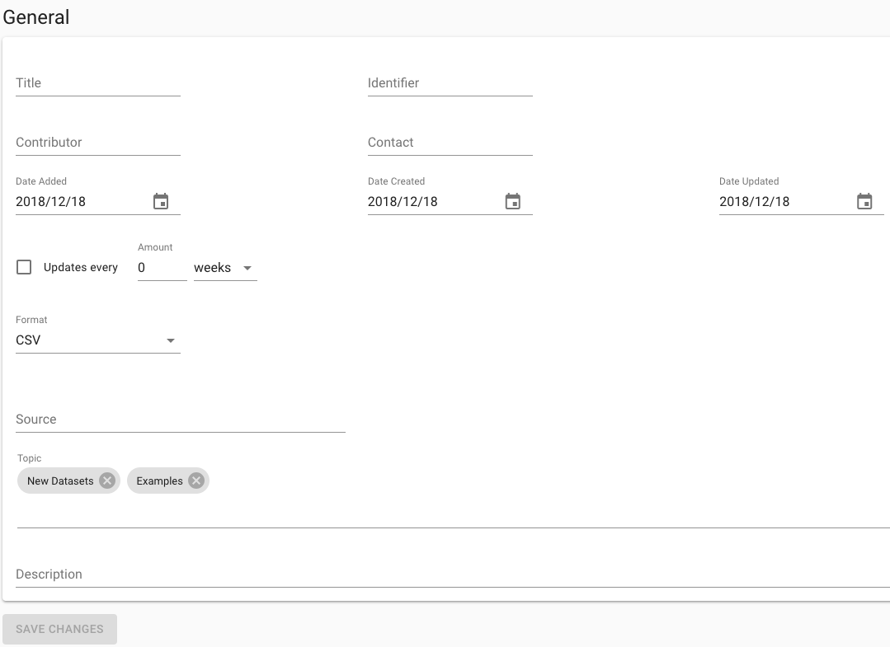
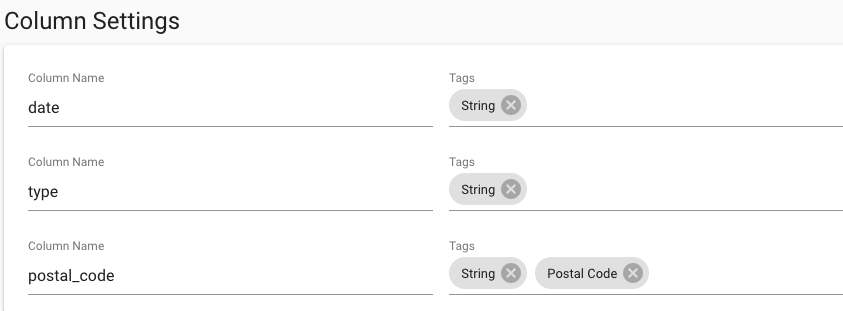

# Metadata

The Synthi platform allows you to store several pieces of general metadata about a dataset. Once you have made changes to the metadata, you'll need to click the *Save Changes* button at the bottom of the section.



## Metadata fields

| Field        | Description        | Defaults     |
| ------------ |:-------------------|:-------------|
|Title|Title for the dataset. Right now, this is not the same as the dataset name used to access the dataset in scripts (which is listed at the top of the dataset). It also does not have to be unique (unlike the dataset name itself).|None|
|Identifier|A URL that points to where the dataset can be found outside of Synthi.|None|
|Contributor|The person or organization responsible for making significant contributions to the dataset.|None|
|Contact|The person or organization to contact about the dataset.|None|
|Date Added|The date the dataset was added to the Synthi platform.|The timestamp of when the dataset record was created|
|Date Created|The date the dataset was originally created. This date may be before the dataset was entered into Synthi.|The timestamp of when the dataset record was created|
|Date Updated|When the dataset was last updated.|The timestamp of the last upload or generate action|
|Updates (flag)|A flag to notify whether or not the dataset is regularly updated|false|
|Update Frequency Amount|The number of days, weeks, or months from the last update to expect another|0|
|Update Frequency Unit|A unit of days, weeks, or months|weeks|
|Format|The file format type. Currently only .csv is supported.|.csv|
|Source|Source of the dataset|None|
|Topic|One or more broad categories that the dataset falls under.(Entered as a token field.)|None|
|Description|General information about the dataset. This is a multi-line field that can contain several paragraphs of text, if necessary.|None|

## API Access to Metadata

The cURL tab of the API shows how you can access metadata information as JSON, programatically, from a tool outside of the Synthi platform:

```bash
curl -s http://localhost:8080/graphql \
-X POST \
-H "Content-Type: application/json" \
-H "Authorization: Api-Key your-api-key" \
--data @- << EOS
{
  "query": "{
    dataset(id: 1234) {
      id
      name
      metadata {
        title
        contributor
        contact
        dateAdded
        dateCreated
        dateUpdated
        updates
        updateFrequencyAmount
        updateFrequencyUnit
        format
        description
        source
        identifier
        topic
      }
    }
  }"
}
EOS
```

Note that you'd need to replace `your-api-key` and `1234` (in `dataset(id: 1234)`) in the above code. As well, if you're not operating in a development environment, `http://localhost:8080` will be used as the base URL of your site. The live site setup that we've automated should not require the port at the end - this is only needed for development.


## Column Settings



When a .csv file is uploaded and imported, its column names will show up in the *Column Settings* section. You can change these names, which will be reflected in most API calls and in the interface. However, please note that you should not yet replace the original header of the .csv file when it is downloaded.

In addition to the column names, each column has a *Tags* section. These are restricted to existing tags that an administrator has added to the database. Documentation for adding tags is included in the technical documentation attached to the project repository. The tags that are added during setup are: String, Float, Integer, and Boolean. These also happen to be the tag types that Pandas can guess from .csv uploads. In most cases, when you upload data, the columns will be correctly identified in terms of their base type, but if not, you can delete the token and add the correct type.

Columns can have multiple tags, and if an administrator adds new options, you can also use those. For example, you may want a "Postal code" tag to identify columns that contain specially formatted strings that actually represent postal codes. In the background, these tags help identify potential connections between columns of different datasets. However, these connections are not yet being used in any features.

Fields in this section are immediately updated. There is no need to explicitly save them.