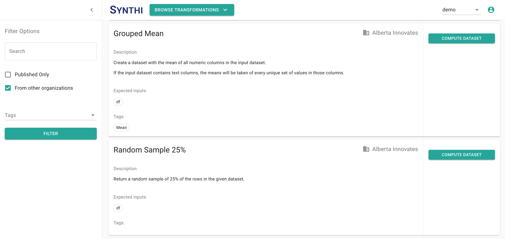

## Browsing Transformations

### Creating a Computed Dataset

You can create a computed dataset directly from the transformation browsing screen once you've found
a transformation you would like to use.

