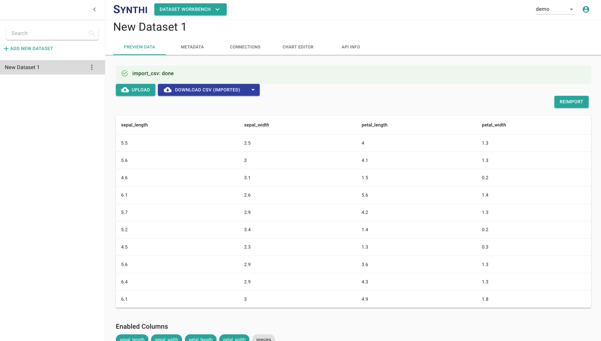

# Uploading a Dataset


There are two different methods of adding datasets to an account. This section will cover how to upload a dataset from a file. For information on how to generate a dataset from existing data on your account, visit the **[Computed Datasets](./ComputedDatasets.md)** section.


To begin, select the green **Add New Dataset** button from the sidebar on the left. ADI will automatically navigate to the new dataset.

From the **Preview Data** tab, select the green **Upload** button. A file browser will appear on your screen. Select the CSV file that you wish to import into ADI.


The file extension of your uploaded will determine the type of dataset it is interpreted as. If the extension is
.csv, it will be seen as structured data and ADI will attempt to extract column metadata. If it is a document type
(such as .doc or .pdf), ADI will attempt to extract raw text data. If it is any other format, ADI does nothing but
store the original file.


If the upload is a CSV file and there are no issues with the CSV's format, a sample of the data should load on 
the screen after it's imported.

Note that the uploaded dataset will be available to anyone in the active organization. The drop down menu on the top right of the next image displays the active organization. There is always a default organization for every user with the same name as the username. However, they can be added to other organizations by a system administrator.

## Troubleshooting

Sometimes a CSV file might be in a format that ADI doesn't expect. When this happens, an error message will appear on the screen or your data will be poorly formatted.

#### Uploading a CSV without headers

If the first line of your CSV file contains raw data instead of headers, ADI will display an error page and offer the option to automatically generate headers for you (you can rename them later).

Ensure that the toggle button for **Does your file contain a header row?** is deselected (moved to the left, it should turn white instead of green) and click the **Rescan Metadata** button to resubmit the CSV file to our servers.

#### Using an unexpected delimiter


You will be able to define custom CSV delimiters in a future version of ADI. Until then, you'll need to handle this issue manually.


ADI expects CSV files to have column values separated by commas. If you use a different delimiter, such as a semicolon, your dataset may appear in a single-column table once it has finished uploading.

In order for your dataset to appear correctly, you'll need to edit your CSV in the text editor of your choice and replace all delimiters with a comma (most text editors have a "Find & Replace" tool that can handle this task automatically). 

Once you've saved the comma-delimited version of your CSV in the text editor, select the **Upload** button on the **Preview Data** tab to upload it. After a few moments, the tab will load the new version and the data will be properly formatted in the table.