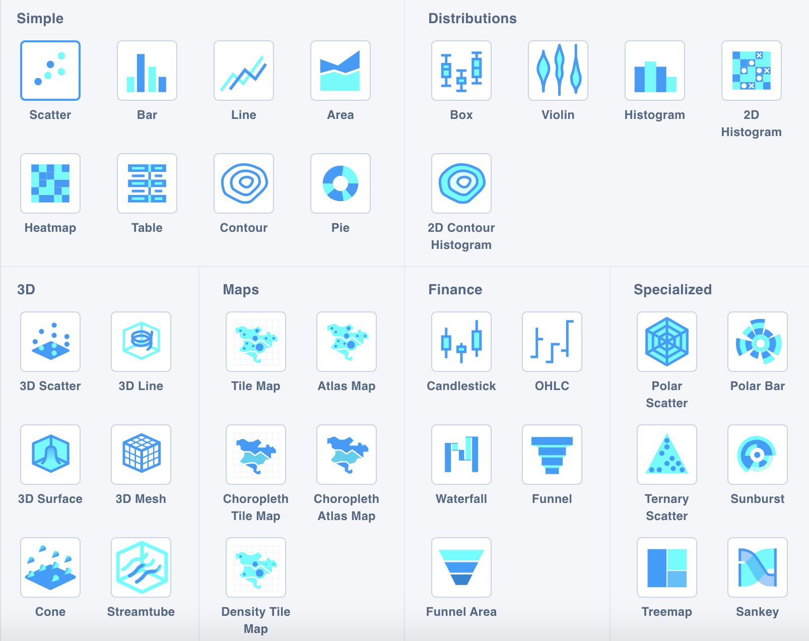

# Visualizing data

The ADI platform uses [Plot.ly](https://plot.ly) to provide easy, interactive, customizable visualizations. Plot.ly itself has some [great tutorials](https://help.plot.ly/tutorials/) and [API documentation](https://plot.ly/javascript/), but we'll go through some of the basics here.

## Visualizing data within ADI

Under every dataset, you can switch to a Chart Editor tab that allows you to create visualizations within ADI:


The chart editor allows you to experiment with a variety of chart types, while seeing the results update right away in a chart on the right.


The chart editor will be pre-loaded with access to all of the columns in the currently selected dataset.



There is currently nothing in place to prevent you from trying to create a chart from a very large dataset. If you click the chart editor, it will try to load everything. This may not be what you want. If your browser becomes unresponsive after clicking on the chart editor, this is a likely suspect.



### Traces

Your starting point with any visualizatiom in the chart editor will be a trace. Think of a trace as a single set of related data points. In a line graph, it would be a single line. In a bar graph, it would be a set of bars, usually with categories on one axis and a continuous measurement on the other. Each trace usually only represents a relationship between 2 variables in your dataset (represented in the chart editor by `X` and `Y` variables). In some cases (such as with 3D charts) there will be a `Z` variable.


What if you need to add another dimension? For example, what if you want to create a grouped or stacked bar chart? One way to handle this is to just add more traces. Each trace will show up with its own legend item and, by default, as a different color.


Example: You have 3 dimensions you'd like to plot with some housing data in a bar chart.

1. Average sale price
2. City/Town
3. Whether the house was a single detached, duplex, or townhouse.

If you're not sure how many cities or towns there will be, or if there will simply be a lot of them, that's a good candidate for your `X` variable. Sale price would be your `Y` variable. And you could create 3 traces, one for each category in the 3rd variable.

Or if you only have a handful of cities/towns you want to compare, you may opt for turning each of those into a trace and using the `X` column for the type of home. There's more than one way to go about visualizing your data, and a lot of that depends on the data itself and the story you want to tell.


### Types of traces

ADI uses [Plot.ly's](https://plot.ly) open source visualization package to create these charts. The underlying technology also power's Plot.ly's Chart Studio.



A great place to get more information on all of the ways you could customize a chart is to go to [Chart Studio's Documentation](https://help.plot.ly/tutorials/). [Plot.ly's Javascript API Documentation](https://plot.ly/javascript/) is another good resource for understanding and seeing examples of the different types of charts you can create. The Chart Editor is basically just a set of visual tools to ultimately create the blocks of Javascript you'll see in the API documentation.

### Transforms

Not to be confused with  *Transformations* in ADI, *Transforms* in the Chart Editor allow you to manipulate the data in your chart further. There are four basic transforms you can do at this level:

1. Filter: remove some data points from being plotted (great for removing outliers in a particular visualization).
2. Split: create multiple traces depending on a variable in your data, which can be styled differently. This is great if you want to represent an extra dimension, but the number of categories is large enough (or more likely to change) that you don't want to create each individually. You don't have quite as much control over the individual styling as if you created each trace yourself.
3. Aggregate: this allows you to summarize multiple data points with some basic operations, such as min, max, first, last, and standard deviation.
4. Sort: this allows you to sort pieces of your visualization (for example, bars in a bar chart) according to some value in the data.


Depending on your data and your workflow, it may be better to do filtering, splitting, or aggregating at the "computed dataset" level. This allows you much more power (you can basically do anything with the data that the Python engine will allow, including more advanced statistical operations), and it can help reduce the size of a dataset to something that's easier for the chart editor to manage.

A large part of visualizing a dataset is first getting the data into the right format to visualize. While Plot.ly's transforms allow you to do some of those operations, if you can get the data closer to the right format via computed datasets first, that's almost always a better approach.


### Styling

If you don't like the default styling, there are many options for further customizing colors, sizes, legends, and other visual aspects of a chart. This section of the Chart Editor can also be used to add specific annotations to the chart, which is really useful  when you want to highlight one or two data points in a busy visualization.

### Saving

The 'Save Plot' button at the bottom of the chart editor will allow you to save your plot to the 'Scenarios' section.



Note that the 'Scenarios' area is largely unfinished. When you save plots to this area, they are not attached to a specific user or organization. Anyone who can log into ADI can see all the charts saved by going to the 'Scenarios' area of ADI.

As well, there's currently no ability to re-open a chart in the Chart Editor if you want to change something. However, you could open the chart in Plot.ly's chart editor service to edit it further.


Or with access to the database, you could export the JSON definition of the chart, edit it by hand, and then re-import it (or include it directly on a webpage that uses the Plot.ly Javascript library).

```
// Exporting JSON from the backend database
:param uuid: "your-plot-uuid"

MATCH (p:Plot { uuid: $uuid })
RETURN p.jsondef

// Importing JSON to the backend database
:param uuid: "your-plot-uuid"
:param jsondef: "your-json-string"

MATCH (p:Plot { uuid: $uuid })
SET p.jsondef = $jsondef
```

You can also save the chart as a .png image.


